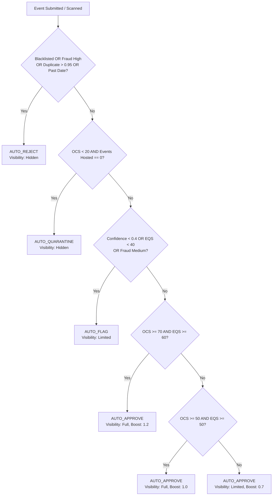

# ACE_AI Module 5: Fully Automated AI Event Verification & Organizer Trust Engine — Design Document

## 1. Architectural Philosophy & Principles

Trust is an **evolving, computed metric (0.0 to 100.0)** rather than a naive binary boolean (`is_trusted`). In a student opportunity ecosystem supporting 1M+ participants, binary trust models fail.

### Core Principles
- **100% Autonomous Decision Making**: No manual human review or approval endpoints exist anywhere in the pipeline.
- **Autonomous Event Decisions**: Every event decision is system-driven: `AUTO_APPROVE`, `AUTO_REJECT`, `AUTO_FLAG`, or `AUTO_QUARANTINE`.
- **Pure Scoring Functions**: All scoring calculation functions (`identity_score`, `historical_score`, `content_score`, `community_score`, `external_score`, `compute_ocs`, `compute_eqs`) are side-effect-free pure functions.
- **Outcome-Based Self-Learning**: The model retrains on post-event outcome rewards (ratings, completion rate, cancellations, complaints) — never on human labels.
- **Immutable Audit Trail**: Every score delta and decision is written to `trust_audits` with reason codes.
- **Read-Only Observability**: Dashboards provide read-only monitoring (`/api/obs/*`) with zero mutation or manual override permissions.

---

## 2. Organizer Credibility Score (OCS) Mathematical Model

The OCS is derived from **5 independent signal layers**:

$$\text{Raw Score} = 0.25 \cdot I + 0.30 \cdot H + 0.15 \cdot C_{\text{event}} + 0.15 \cdot M + 0.15 \cdot E$$

Where:
- $I$: Identity Verification Layer ($\max 70$)
- $H$: Historical Performance Layer ($\max 50$)
- $C_{\text{event}}$: Event Content Quality Layer ($\max 35$)
- $M$: Community Feedback Layer (Range: $-35$ to $+30$)
- $E$: External Validation Layer ($\max 45$)

The maximum theoretical composite raw score is:
$$\text{Max Raw} = (0.25 \times 70) + (0.30 \times 50) + (0.15 \times 35) + (0.15 \times 30) + (0.15 \times 45) = 49.0$$

The final score is normalized:
$$\text{OCS}_{\text{normalized}} = \min\left(100.0, \frac{\text{Raw Score}}{49.0} \times 100.0\right)$$

---

## 3. Autonomous Decision Pipeline (`auto_decision.py`)

Every event submitted or scanned moves through the autonomous decision pipeline:

---

## 4. Autonomous Feedback Loop & Retraining (`self_learning.py`)

The system automatically retrains and adjusts thresholds based on post-event outcome rewards:

$$\text{Reward} = + \text{event\_happened} \cdot 30 + \left(\frac{\text{avg\_rating}}{5}\right) \cdot 25 + \text{reg\_rate} \cdot 20 - \text{complaints} \cdot 15 - \text{cancellation} \cdot 20$$

- **Scheduled Retrainer Worker**: Runs every 24 hours via `workers/retrain_worker.py`.
- **Model Checkpointing**: Atomically updates model version `auto_decision_v{YYYYMMDD_HHMMSS}.pkl` when validation AUC improves.

---

## 5. Anti-Gaming & External Verification

- **Delta Capping**: OCS changes capped at $\pm 5.0$ per event.
- **Inactivity Decay**: 5% decay every 180 inactive days.
- **Automated External Validation**: Scrapes college websites, checks LinkedIn profile activity, WHOIS domain age, and news mentions asynchronously.
- **Zero Human Override**: Endpoints are strictly GET read-only for monitoring and auditing.
